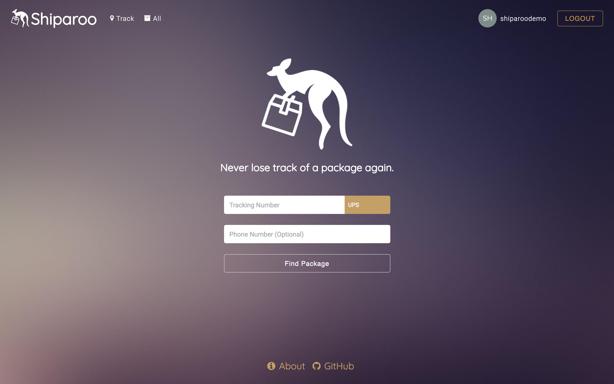
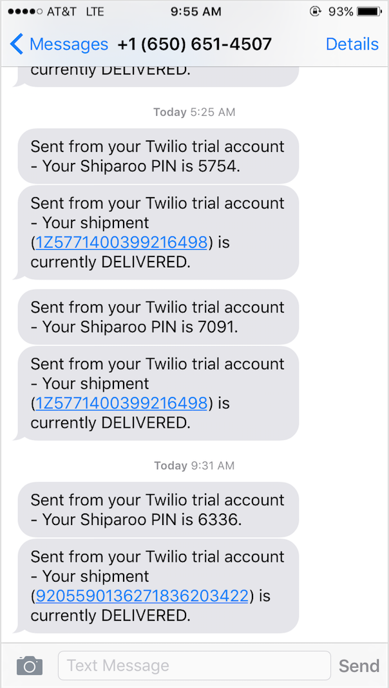

# Shiparoo

It's always tough waiting for a package. It's even tougher not knowing when it will arrive. With Shiparoo, users can find out where their package is at all times. By inputting a phone number along with their tracking number, users can easily receive realtime updates on the status of their packages from delivery to arrival. Never lose track of another package again!

[Live][live]
[live]:http://www.shiparoo.us
Shiparoo is the web version of [Shiparoo-iOS][shiparoo-ios].
[shiparoo-ios]:https://github.com/justinsuen/shiparoo-ios

Shiparoo and Shiparoo-iOS are personal projects by Calvin Yau, Daniel Chang, and Justin Suen.

## Features

### SMS Package Tracking

Enter in a phone number and receive text updates for your package until it is delivered. Twilio sends updates through SMS while Shippo retrieves package information.

### PIN Verification

Receive a PIN for verification when tracking a package for text updates.

![pin_modal][pin_modal]
[pin_modal]: ./docs/images/pin_modal.png

### Map and History View

Enter in a tracking number and see tracking history. In addition, view tracking history on a Google Map. A path is drawn on Google Maps API based on tracking location and history.

![details][details]
[details]: ./docs/images/package_details.png

### User Authentication

Package tracking information is saved for users who signed up. Users can view all their package tracking history. Authentication is provided by Auth0, which uses OmniAuth.

## Architecture & Technology

### Deployment
- Amazon Web Services - Elastic Beanstalk
- Webpack for frontend JavaScript and React
- PostgreSQL through Amazon RDS services

### Backend
- Ruby on Rails
- PostgreSQL
- Shippo API calls
  - Status updates through API calls

### Frontend
- React with Redux
  - Use react-router and browserHistory for clean URLs
  - Single-page application experience
  - Not found page is handled by react-router as well

- Shippo API
  - Request data passed to Shippo API by POSTing JSON objects with the appropriate key/value-pairs to the corresponding resource.
  - Response data returns JSON object with details on specific package including current status and status history.

- Twilio API
  - PIN factor authentication to verify users and their package.
  - Sends realtime updates every time the status on their package is changed.
  - Updates stop once package has status of `DELIVERED`.

- Auth0
  - Allows signing up with Facebook or Google accounts, or personal emails
  - Utilizes localStorage for session handling
  - Allows users to have Gravatars or images from Facebook and Google accounts for personalization

- Google Maps API
  - Visualize package shipping routes

## Original Design

Our initial ideas and wireframe designs can be found here.
[Docs] (./docs)

## Future Implementations
- Auto detect carrier on tracking number input
- User profile editing
- Email updates
